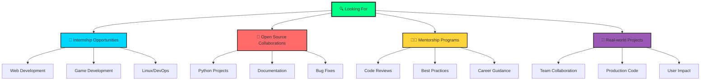

# 🚀 Muhammedali Shakhnazarov

<div align="center">
  


</div>

<div align="center">
  
[](https://t.me/totyeshotip)
[](mailto:010107shah@gmail.com)
[](https://github.com/Vorchunello)
[](https://github.com/Vorchunello)

</div>

---

## 🎯 About Me

```python
class Developer:
    def __init__(self):
        self.name = "Muhammedali Shakhnazarov"
        self.location = "Surgut, Russia 🏔️"
        self.education = "Software Engineering @ Surgut State University"
        self.passionate_about = ["Clean Code", "Game Development", "Open Source"]
        self.current_status = "Seeking opportunities to grow and contribute"
        self.philosophy = "If you catch some bug - Get some tea! 🍵"
        self.linux_journey = "Ubuntu → Fedora → NixOS → ∞"
        self.tea_consumed = "∞ cups and counting ☕"
    
    def get_daily_routine(self):
        activities = [
            "🍵 Morning tea ritual & planning",
            "💻 Crafting elegant solutions",
            "🐧 Mastering Linux mysteries", 
            "🎮 Bringing game ideas to life",
            "📚 Absorbing new knowledge",
            "🔧 Breaking things (then fixing them)",
            "🌙 Late night coding sessions"
        ]
        return random.choice(activities)
    
    def current_mood(self):
        return "Ready to build something awesome! 🚀"

# Initialize developer instance
me = Developer()
print(me.philosophy)  # If you catch some bug - Get some tea! 🍵
```

<div align="center">

### 🔥 Quick Stats


</div>

---

## 🛠️ Tech Arsenal

<div align="center">

### 💻 Languages & Frameworks


### 🎮 Game Development & Tools


### 🐧 Linux Mastery Journey


</div>

---

## 📊 System Status

```bash
$ neofetch --ascii_distro NixOS

┌─ Learning Progress ──────────────────────────────────────┐
│ Python        ████████████████████▓░░   95% 🔥          │
│ Linux CLI     ██████████████████▓░░░   90% 🐧          │
│ Django        ███████████████▓░░░░░░   75% 🌐          │
│ Godot         ████████████▓░░░░░░░░░   60% 🎮          │
│ C/C++         ██████▓░░░░░░░░░░░░░░░   30% 📈          │
│ Git           ████████████▓░░░░░░░░░   60% 🔧          │
│ Tea Brewing   ████████████████████▓   99% ☕          │
└──────────────────────────────────────────────────────────┘

System Uptime: 3+ years on Linux 🐧
Current Distro: NixOS (because why make life easy? 😄)
Favorite Editor: Whatever gets the job done
Debug Method: printf() and strategic tea breaks ☕
```

---

## 🚧 Current Projects & Digital Experiments

<div align="center">

```javascript
const currentProjects = {
    "🌐 Django Web Apps": {
        status: "⚡ In Progress",
        description: "Building modular auth systems & CRUD magic",
        techStack: ["Python", "Django", "PostgreSQL"],
        excitement: "High"
    },
    "🎮 Godot Prototypes": {
        status: "🔄 Active Development", 
        description: "2D game mechanics & UI wizardry",
        techStack: ["GDScript", "Godot", "Pixel Art"],
        excitement: "Through the roof!"
    },
    "🐧 Linux Automation": {
        status: "🔧 Continuous",
        description: "Custom CLI tools & system sorcery", 
        techStack: ["Bash", "Python", "NixOS"],
        excitement: "Nerd level 100"
    },
    "📚 C/C++ Journey": {
        status: "📖 Learning",
        description: "Diving into low-level programming",
        techStack: ["C", "C++", "Make", "GDB"],
        excitement: "Challenging but rewarding"
    }
};

console.log("🚀 Repositories coming soon - currently polishing gems!");
```

</div>

---

## 🎓 Academic Foundation

<div align="center">

```yaml
University: Surgut State University
Degree: Software Engineering (In Progress)
Mathematical Toolkit:
  - Calculus: ✅ Derivatives & Integrals mastered
  - Linear Algebra: ✅ Matrices are my friends
  - Discrete Math: ✅ Logic & Algorithms
  - Problem Solving: ✅ Breaking complex into simple
Status: "Learning something new every day 📚"
```

</div>

---

## 🌍 Multilingual Communication

<div align="center">

| Language | Proficiency | Usage |
|----------|-------------|-------|
| 🇷🇺 Russian | Native | Primary thoughts & dreams |
| 🇬🇧 English | Intermediate | Code documentation & global communication |
| 🇹🇷 Turkish | Fluent | Cultural bridge & family conversations |

</div>

---

## 💡 What Drives My Code

```python
class Motivation:
    def __init__(self):
        self.core_values = [
            "🔥 Passionate about meaningful technology",
            "🌱 Continuous learning mindset", 
            "🤝 Collaborative spirit - great things built together",
            "🎯 Quality over quantity philosophy",
            "🚀 Innovation with purpose"
        ]
        
        self.current_goals = {
            "short_term": [
                "Master C/C++ fundamentals",
                "Contribute to open source projects", 
                "Build portfolio-worthy projects",
                "Find amazing mentorship opportunities"
            ],
            "long_term": [
                "Become a skilled full-stack developer",
                "Create games that tell meaningful stories",
                "Contribute to Linux ecosystem",
                "Build tools that make developers' lives easier"
            ]
        }
    
    def get_inspiration(self):
        return "Every bug is a puzzle waiting to be solved! 🧩"

motivation = Motivation()
```

---

## 🎯 Currently Seeking

<div align="center">



</div>

---

## 📈 GitHub Activity & Stats

<div align="center">


</div>

---

## 🍵 Philosophy & Fun Facts

<div align="center">

```ascii
    ☕ "If you catch some bug - Get some tea!" ☕
    
    Fun Facts:
    ├── 🐧 Survived the Ubuntu → Fedora → NixOS journey
    ├── ☕ Tea-to-code ratio: Perfectly balanced
    ├── 🌙 Best debugging happens at 2 AM
    ├── 🔧 Can fix anything with enough StackOverflow
    └── 🚀 Dreams in Python, thinks in algorithms
    
    Current Status: [ Ready to build the future! ]
```

</div>

---

<div align="center">

### 🌟 Let's Connect & Build Something Amazing!

[](https://wakatime.com/@YOUR_USER_ID)

---

<sub>🎨 **Handcrafted with ❤️, ☕, and lots of Linux magic**</sub>  
<sub>⚡ **Last updated:** Every time I learn something new (which is daily!)</sub>  
<sub>🌟 **Star this repo if it made you smile!**</sub>

```bash
$ whoami
muhammedali_shakhnazarov

$ echo "Thanks for visiting my digital space! 🚀"
Thanks for visiting my digital space! 🚀
```

</div>
